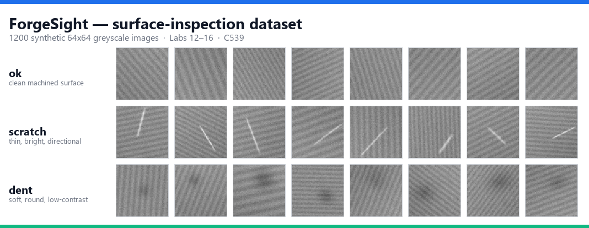

<div align="center">

# AI Vibe Coding with PyTorch Deep Learning

[](https://www.tertiarycourses.com.sg/deep-learning-with-pytorch.html)
[](https://pytorch.org)
[](https://www.python.org)
[](#the-vibe-coding-loop)
[](#license)

**Twenty-one hands-on labs for building real deep learning models in PyTorch with an AI coding assistant — from tensors and autograd to CNNs, LSTMs and a packaged project you can hand to a colleague.**

[📘 Course Page](https://www.tertiarycourses.com.sg/deep-learning-with-pytorch.html) · [📖 Learner Guide](LG-AI%20Vibe%20Coding%20with%20PyTorch%20Deep%20Learning.md) · [🧪 All Labs](labs/) · [🐛 Report Bug](https://github.com/tertiarycourses/C539-AI-Vibe-Coding-with-PyTorch-Deep-Learning/issues)



</div>

> [!NOTE]
> **These are the official hands-on lab materials for the course:**
> ### 🎓 AI Vibe Coding with PyTorch Deep Learning
> **Course Code:** `C539` · by Tertiary Courses / Tertiary Infotech
> **Course page:** https://www.tertiarycourses.com.sg/deep-learning-with-pytorch.html
> **Format:** 2 days · 15 instructional hours · 4 topics · 21 labs · CPU-only, no GPU required

---

## About

This repository contains the complete lab materials for **AI Vibe Coding with PyTorch Deep Learning (C539)** by Tertiary Courses / Tertiary Infotech.

The premise: **the AI writes the PyTorch, you own the model.** An assistant that produces runnable deep learning code is easy. An assistant that produces a model you can *defend* needs you to know what a right answer looks like — and that is what these two days build.

Deep learning punishes blind trust harder than ordinary programming, because a network with a silently wrong loss function still trains, still prints a decreasing number, and still returns confident predictions. Every lab therefore ends in a **Test it** step that forces you to verify the generated result — a shape, a gradient, a metric, a saved file — and several labs deliberately lead the assistant into a wrong-but-runnable answer so you learn to catch it.

### One project, twenty-one labs

The labs are not twenty-one disconnected exercises. Every lab advances **ForgeSight**, a deep learning suite for a precision metal-parts factory, from an empty folder in Lab 1 to a packaged, documented project in Lab 21. The factory gives all three data modalities a single home:

| Data | Models | Labs |
|---|---|---|
| Tabular machine telemetry | Tool-wear regression · 4-class QC classification | 3–11 |
| Surface-inspection images | CNN defect classifier · transfer learning | 12–16 |
| Vibration sensor readings | LSTM time-series forecasting | 17–20 |

Each lab states the exact files it expects to already exist, so you can rejoin at any lab boundary if you fall behind.

---

## Lab Activities

### Topic 01 — AI Vibe Coding for PyTorch Fundamentals

| # | Lab | What you build |
|---|-----|----------------|
| **1** | [What Is AI Vibe Coding](labs/lab01-what-is-ai-vibe-coding-your-first-pytorch-from-a-prompt/) | Your first PyTorch from a prompt, in Colab — vague vs. specific, compared |
| **2** | [Setting Up Cursor, Copilot and Claude](labs/lab02-setting-up-cursor-github-copilot-and-claude-for-pytorch/) | The `torch-vibe/` workspace, verified end to end |
| **3** | [Prompting Patterns](labs/lab03-prompting-patterns-for-correct-deep-learning-code/) | The five-part prompt pattern that catches a leakage bug |
| **4** | [Tensor Operations](labs/lab04-vibe-coding-pytorch-tensor-operations/) | Shapes, broadcasting, and two shape errors you cause on purpose |
| **5** | [Computation Graphs and Autograd](labs/lab05-computation-graphs-and-autograd-with-ai-assistance/) | A hand-verified gradient, plus `detach`, `no_grad` and accumulation |
| **6** | [Reviewing and Debugging AI Code](labs/lab06-reviewing-and-debugging-ai-generated-pytorch-code/) | Five real defects found in a script that runs perfectly |

### Topic 02 — Vibe Coding Neural Networks

| # | Lab | What you build |
|---|-----|----------------|
| **7** | [Architectures, Activations and Losses](labs/lab07-neural-network-architectures-activation-and-loss-functions/) | A proof that layers without activations collapse into one |
| **8** | [A Regression Model](labs/lab08-vibe-coding-a-regression-model-in-pytorch/) | A tool-wear network that beats the mean baseline |
| **9** | [Classification with Cross Entropy](labs/lab09-vibe-coding-a-classification-model-with-softmax-and-cross-entropy/) | A QC classifier — and the softmax trap, caught numerically |
| **10** | [Training Loops and Optimizers](labs/lab10-generating-training-loops-optimizers-and-metrics-from-prompts/) | One reusable `fit()` driving every model that follows |
| **11** | [Saving, Loading and Iterating](labs/lab11-saving-loading-and-iterating-on-models/) | A checkpoint that reloads to identical predictions |

### Topic 03 — Vibe Coding Convolutional Neural Networks

| # | Lab | What you build |
|---|-----|----------------|
| **12** | [Convolution, Pooling and Padding](labs/lab12-overview-of-cnns-convolution-pooling-and-padding/) | Every feature-map shape predicted before it is printed |
| **13** | [A CNN Image Classifier](labs/lab13-vibe-coding-a-cnn-image-classifier/) | A defect classifier with a confusion matrix and error grid |
| **14** | [Diagnosing Overfitting](labs/lab14-diagnosing-overfitting-with-ai-assistance/) | The epoch where generalisation stops, measured |
| **15** | [Augmentation and Regularization](labs/lab15-data-augmentation-and-regularization-via-prompts/) | An ablation table showing what each remedy actually bought |
| **16** | [Transfer Learning](labs/lab16-transfer-learning-with-pre-trained-models/) | A fine-tuned ResNet-18 vs. your scratch CNN |

### Topic 04 — Vibe Coding Recurrent Networks for Sequence Data

| # | Lab | What you build |
|---|-----|----------------|
| **17** | [RNNs, LSTM and GRU](labs/lab17-overview-of-rnns-lstm-and-gru/) | The vanishing gradient, measured on a log axis |
| **18** | [An LSTM Forecaster](labs/lab18-vibe-coding-an-lstm-for-time-series-forecasting/) | A forecaster that beats persistence — with the split verified |
| **19** | [Tuning with Follow-Up Prompts](labs/lab19-tuning-sequence-models-with-follow-up-prompts/) | A one-factor-at-a-time table you can defend |
| **20** | [Evaluating and Visualizing](labs/lab20-evaluating-and-visualizing-model-performance/) | The views that reveal what a single metric hides |
| **21** | [Packaging the Project](labs/lab21-packaging-a-complete-deep-learning-project/) | A project a colleague runs from the README alone |

> 📖 **Full walkthrough:** see the **[Learner Guide](LG-AI%20Vibe%20Coding%20with%20PyTorch%20Deep%20Learning.md)** for detailed step-by-step instructions for every lab. Slides, the Learner Guide and the Lesson Plan are in [`courseware/`](courseware/).

---

## The Vibe Coding Loop

Every lab runs the same six-step loop. The skill being trained is steps 4 and 5.

```
1. FRAME     State the tensor shapes, the task, the layers, the constraints
             and the expected output — in one prompt.
2. GENERATE  Let the assistant write the PyTorch. Read it before you run it.
3. RUN       Execute it on real data. Look at the actual shapes and losses,
             not just the absence of a traceback.
4. VERIFY    Check against what you expected. Compare to the BASELINE.
             Inspect the samples it gets wrong.
5. REFINE    Feed back the specific symptom — not "fix it" — and ask for a
             targeted change. Repeat.
6. KEEP      Save the working script with a comment recording WHY the
             architecture, the loss and the metric are what they are.
```

### The bugs this course teaches you to catch

Each of these produces **running code, a falling loss and confident predictions** — and every one is planted somewhere in the labs:

| Bug | Lab | Symptom |
|-----|-----|---------|
| `nn.Softmax` before `nn.CrossEntropyLoss` | 9 | Softmax applied twice; gradients flattened; model learns slowly |
| Missing `optimizer.zero_grad()` | 5, 6 | Gradients accumulate across batches; updates too large |
| Prediction `(N,1)` vs target `(N,)` | 4, 8 | `MSELoss` broadcasts to `(N,N)`; loss is meaningless, no error raised |
| Scaler fitted before the train/test split | 3, 6 | Test information leaks; the score is unachievable in production |
| Augmentation applied to validation | 15 | Validation score changes every run and is systematically pessimistic |
| Evaluating without `model.eval()` | 6, 11 | Dropout stays active; the reported score is noisy and wrong |
| Wrong axis out of `nn.LSTM` / `batch_first` | 17, 18 | Right-shaped tensor, completely wrong contents |
| Random split on a time series | 18 | The model trains on the future; beautiful plots, useless model |

---

## Tech Stack

| Category | Technology |
|----------|------------|
| **Framework** | [PyTorch](https://pytorch.org) (CPU build — no GPU required) |
| **Vision** | `torchvision` — `ImageFolder`, transforms, pre-trained ResNet-18 |
| **AI Assistants** | [Cursor](https://cursor.com), [GitHub Copilot](https://github.com/features/copilot), [Claude](https://claude.ai) |
| **Editors** | PyCharm · VS Code · Cursor |
| **Data** | pandas, NumPy (synthetic ForgeSight telemetry, images and sensor series) |
| **Metrics & Plots** | scikit-learn metrics, matplotlib |
| **Testing / Packaging** | pytest, `pip freeze`, model cards |
| **Fallback** | [Google Colab](https://colab.research.google.com) — Lab 1 runs there with nothing installed |
| **Courseware** | Slides (`python-pptx`), Learner Guide + Lesson Plan (`python-docx`) |

---

## Architecture

```
DAY 1 — Fundamentals to first networks
  Topic 1  Labs 1–6    prompt ─▶ PyTorch ─▶ read ─▶ run ─▶ verify
           Lab 1  Colab: vague prompt vs. five-part prompt
           Lab 4  tensors ─▶ shapes, broadcasting, deliberate shape errors
           Lab 5  autograd ─▶ backward() ─▶ .grad vs. hand-derived gradient
           Lab 6  buggy script ─▶ checklist review ─▶ targeted fixes
  Topic 2  Labs 7–11   telemetry ─▶ nn.Module ─▶ loss ─▶ trained model
           Lab 8  6 sensors ─▶ Linear/ReLU stack ─▶ MSELoss ─▶ tool wear (µm)
           Lab 9  6 sensors ─▶ raw logits ─▶ CrossEntropyLoss ─▶ QC class
           Lab 10 engine.fit() ─▶ optimizer × learning-rate sweep
           Lab 11 state_dict + config + scaler stats ─▶ reload ─▶ identical preds

DAY 2 — Vision, sequences and shipping
  Topic 3  Labs 12–16  images ─▶ Conv/Pool ─▶ CNN ─▶ regularize ─▶ transfer
           Lab 12 64×64 ─▶ Conv(p=1) ─▶ Pool ─▶ … ─▶ flatten = 64·8·8 = 4096
           Lab 13 ImageFolder ─▶ DefectCNN ─▶ confusion matrix
           Lab 14 60 epochs unregularized ─▶ train/val divergence epoch
           Lab 15 augment(train only) + dropout + weight decay + early stop
           Lab 16 ResNet-18 frozen ─▶ new head ─▶ unfreeze layer4 @ lr/10
  Topic 4  Labs 17–21  series ─▶ window ─▶ LSTM ─▶ tune ─▶ evaluate ─▶ package
           Lab 17 RNN vs LSTM vs GRU ─▶ shapes, gates, vanishing gradient
           Lab 18 window(48→1) ─▶ chronological split ─▶ LSTM vs persistence
           Lab 19 one-factor-at-a-time sweep ─▶ defensible best config
           Lab 20 parity · confusion · forecast-vs-actual ─▶ findings.md
           Lab 21 src/ + models/ + tests/ + predict.py ─▶ handover test
```

---

## Project Structure

```
C539-AI-Vibe-Coding-with-PyTorch-Deep-Learning/
├── README.md
├── LG-AI Vibe Coding with PyTorch Deep Learning.md   # Learner Guide (Markdown mirror)
├── screenshot.png                                    # ForgeSight defect dataset preview
│
├── labs/                              # 21 hands-on labs, one folder each
│   ├── README.md                      # Lab index + the ForgeSight project map
│   ├── lab01-…  →  lab21-…/README.md  # Goal · Steps (PROMPT/COMMAND) · Test it · Troubleshooting
│   └── resources/                     # Datasets and scripts the labs need
│       ├── machines.csv               # 4000 rows telemetry — regression + 4-class targets
│       ├── vibration_series.csv       # 3000 hourly readings — LSTM forecasting
│       ├── make_images.py             # Generates the 1200-image defect set (Lab 12)
│       ├── train_wear_buggy.py        # Runs fine, wrong in five places (Lab 6)
│       └── make_data.py               # Regenerates both CSVs
│
└── courseware/                        # Slides, Lesson Plan and Learner Guide
    ├── AI Vibe Coding with PyTorch Deep Learning-v1.0.pptx   # 241-slide deck (+ PDF)
    ├── LG-AI Vibe Coding with PyTorch Deep Learning.docx     # Learner Guide (+ PDF)
    └── LP-AI Vibe Coding with PyTorch Deep Learning.docx     # 2-day Lesson Plan (+ PDF)
```

---

## Getting Started

### Prerequisites
- **Python 3.10+** — from [python.org](https://www.python.org/downloads/) or Anaconda / Miniconda
- **An AI coding assistant** — [GitHub Copilot](https://github.com/features/copilot), [Cursor](https://cursor.com), or [Claude](https://claude.ai) in a browser tab
- **An editor** — PyCharm, VS Code or Cursor
- **~3 GB free disk space** — PyTorch, torchvision and the ResNet-18 weights are the largest downloads
- *(optional)* A **Google account** for the [Colab](https://colab.research.google.com) fallback — Lab 1 runs there with nothing installed
- **No GPU required.** Every lab is sized to run on CPU.

### 1. Clone the repo
```bash
git clone https://github.com/tertiarycourses/C539-AI-Vibe-Coding-with-PyTorch-Deep-Learning.git
cd C539-AI-Vibe-Coding-with-PyTorch-Deep-Learning
```

### 2. Create the course workspace (Lab 2)
```bash
mkdir torch-vibe && cd torch-vibe
python -m venv .venv
.venv\Scripts\activate          # Windows  (macOS/Linux: source .venv/bin/activate)

pip install torch torchvision --index-url https://download.pytorch.org/whl/cpu
pip install pandas matplotlib scikit-learn

mkdir data models reports
```

### 3. Add the data
```bash
cp ../labs/resources/machines.csv ../labs/resources/vibration_series.csv data/
cp ../labs/resources/make_images.py .
python make_images.py          # generates data/defects/ (Lab 12)
```

### 4. Verify the environment
```bash
python -c "import sys, torch, torchvision, pandas, numpy, matplotlib; \
print('python', sys.version.split()[0]); print('torch', torch.__version__); \
print('environment ready')"
```

Then start at **[Lab 1](labs/lab01-what-is-ai-vibe-coding-your-first-pytorch-from-a-prompt/)** and work through in order — each lab reuses the workspace, the data and the prompting habits of the one before it.

> [!TIP]
> Every lab gives you a starting **PROMPT** to paste into your assistant and a **Test it** step that tells you exactly what a correct result looks like. Read the generated code *before* you run it, and predict the shapes — that habit is the entire point of the course.

### Baselines to beat

A number is only meaningful next to its baseline. Every model in the course is judged against one:

| Task | Baseline | Value |
|------|----------|-------|
| Tool-wear regression | Predict the training mean | MAE ≈ **13.6 µm** |
| QC classification | Predict the majority class | ≈ **57.6%** accuracy |
| Defect image classification | Predict the majority class | ≈ **33.3%** accuracy |
| Vibration forecasting | Persistence (next = last) | MAE ≈ **0.0284** |

All data is synthetic and deterministic (seed 42), so your numbers should match the Learner Guide — and it is safe to paste into an AI assistant. See [`labs/resources/README.md`](labs/resources/README.md).

---

## Contributing

Contributions, fixes, and improvements are welcome:

1. **Fork** the repository
2. Create a feature branch: `git checkout -b feature/my-improvement`
3. Commit your changes: `git commit -m "Add my improvement"`
4. Push the branch: `git push origin feature/my-improvement`
5. Open a **Pull Request**

Found a bug or have an idea? Open an [issue](https://github.com/tertiarycourses/C539-AI-Vibe-Coding-with-PyTorch-Deep-Learning/issues).

---

## License

This material is provided for **educational use** as part of the course **C539 — AI Vibe Coding with PyTorch Deep Learning**. © Tertiary Infotech Pte. Ltd. All rights reserved.

---

## Developed By

**Tertiary Infotech Pte. Ltd.** — [Tertiary Courses](https://www.tertiarycourses.com.sg)
Course: [AI Vibe Coding with PyTorch Deep Learning (C539)](https://www.tertiarycourses.com.sg/deep-learning-with-pytorch.html)

## Acknowledgements

- [PyTorch](https://pytorch.org) & [torchvision](https://pytorch.org/vision) — the deep learning framework and pre-trained models
- [Cursor](https://cursor.com), [GitHub Copilot](https://github.com/features/copilot) & [Claude](https://claude.ai) — the AI pair programmers
- [scikit-learn](https://scikit-learn.org) & [matplotlib](https://matplotlib.org) — metrics and plots
- Course trainers and learners of C539

---

<div align="center">

⭐ **If this helped you learn PyTorch, star the repo!**

Powered by [Tertiary Infotech Academy Pte Ltd](https://www.tertiaryinfotech.com/)

[📘 Course Page](https://www.tertiarycourses.com.sg/deep-learning-with-pytorch.html) · [📖 Learner Guide](LG-AI%20Vibe%20Coding%20with%20PyTorch%20Deep%20Learning.md)

</div>
